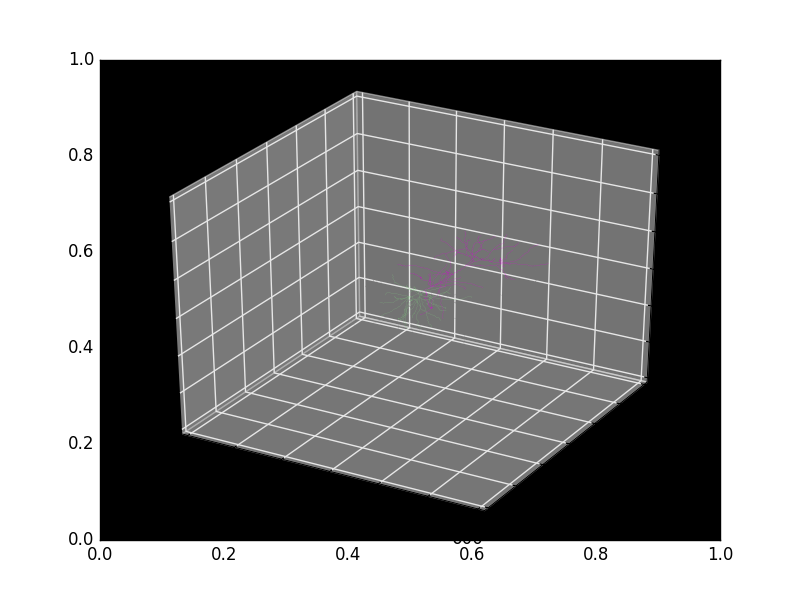
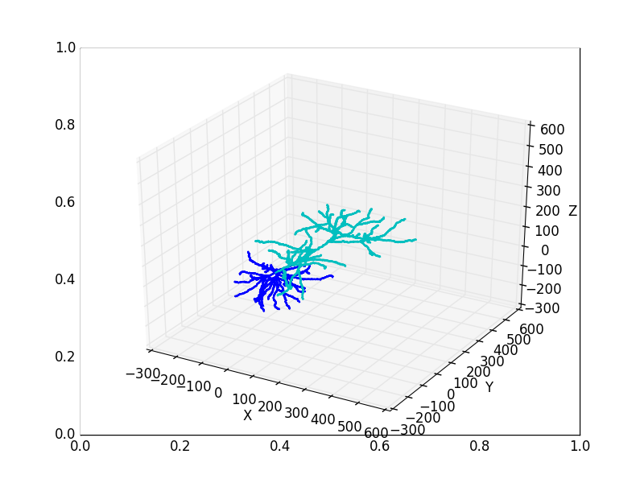

################
Visualization
################

Visualization is highly customizable in btmorph because you can access the data directly and subsequently use all available Python tools to visualize the data. Visualizing a neurite boils down to looping over all nodes in the tree and plotting a line segment in between the current node and its parent. As such, end users can implement their own visualization flexibly and efficiently. 

In addition to the "DIY" method btmorph also contains several wrappers to quickly generate some standard visualizations of neurites. Below we illustrate the plotting capabilities included in btmorph. Please consult the API for more details about the visualization wrappers. All wrapper use standard Matplotlib functionality. 

.. note:: As in the previous tutorial, we assume the user is in the :code:`examples` directory of the btmorph package. The exemplar neurons are from the Kawaguchi archive and downloaded from `NeuroMorpho.org <http://neuromorpho.org/neuroMorpho/neuron_info.jsp?neuron_name=CTh5080306F>`_. Using the btmorph function `filter_and_save_SWC` we obtained "filtered" versions that only contain the basal and apical trees. These data files can be found in the folder `examples/data`.

2D plotting
-----------

Basic 2D plotting is provided and entails a straightforward projection onto the XY plane. First, we set up some of the files for later use.
::
   full_fn = "data/CTh5080306F.CNG.swc"
   filtered_fn = "data/CTh5080306F.CNG_filtered.swc"
   basal_fn = "data/CTh5080306F.CNG_filtered_basal.swc"
   apical_fn = "data/CTh5080306F.CNG_filtered_apical.swc"

The color scheme used for 2D plotting can be adjusted. Currently only two schemes are in use: a default one and the one used by `NeuroMorpho.org <http://www.neuromorpho.org>`_. Execute the following command:
::
   import btmorph2
   full = btmorph2.NeuronMorphology(full_fn)
   full.plot_2D()

.. image:: figures/full_default.png
  :scale: 50   
   
When no arguments are given, defaults for the color are provided.

There are two ways to override the default colors. First by setting the `color_scheme="neuromorpho"`, which uses the NeuroMorpho.org color scheme as illustrated below.
::
   import btmorph2
   full = btmorph2.NeuronMorphology(full_fn)
   full.plot_2D(color_scheme="neuromorpho")

.. image:: figures/full_neuromorpho.png
  :scale: 50   

A slight variation is shown below and uses the `color_scheme='neuromorpho'`. But because thin neurites are hardly visible we can better draw a wire plot in which all neurites have the same diameter; set globally in the `btmorph2/config.py` file.
::

   full.plot_2D(color_scheme="neuromorpho")
   full.plot_2D(color_scheme="neuromorpho",show_radius=False)

.. |nm| image:: figures/full_nm.png
  :scale: 37

.. |nm_wire| image:: figures/full_nm_wire.png
  :scale: 37

+---------+-----------+
| |nm|    | |nm_wire| |
+---------+-----------+

.. note:: Plots can be either saved by using the interactive command in Ipython: `savefig('name.extension')` (and see the `matplotlib <http://matplotlib.org/api/pyplot_api.html#matplotlib.pyplot.savefig>`_ documentation for more info about the `savefig` command). Another option in btmorph is to provide the `outN` argument. The value of this argument has to be a string of the form :code:`'name.extension'`; either the full path can be included in the name or a relative path to save the figure in the current working directory.

..
   A nice way to visualize variation in a set of morphologies is by plotting a spatial density of the neurites. In btmorph this can be achieved by the population_2D_density_projections. 
   ::
      import btmorph
      btmorph.population_density_projection(destination='data/pyr_pop/', \
         filter='*.swc', outN="data/pyr_pop/density.png", precision=[10, 10, 10],depth='Y')

   and results in the following image:

   .. image:: figures/density_2D.png
     :scale: 50

   Pseudo 3D plotting
   ------------------

   A 2D projection does not tell much about the spatial embedding of a neuron outside the projected plane. But 3D figures can become easily cluttered if many neurites are contained in one file. Therefore, we include two options for "pseudo 3D" plotting; that is, a plot containing three 2D projections that shows the neuron along three orthogonal axes. 

   To plot a plain-vanilla pseudo 3D figure, execute the following command:
   ::
      import btmorph
      btmorph.true_2D_projections(filtered_fn,depth="Y",bar=[100,1000,100])

   .. image:: figures/pseudo_3D.png
     :scale: 50

   A similar pseudo 3D version is also available for the density plot.
   ::
      import btmorph
      btmorph.population_2D_density_projections(destination='data/pyr_pop/', \
         filter='*.swc', outN="data/pyr_pop/density.png", precision=[10, 10, 10])

   .. image:: figures/density_pseudo_3D.png
     :scale: 50

3D plotting
-----------

A 3D plot can still be convenient especially when you can interactively adjust the point of view using :code:`ipython --pylab -i`. The syntax is the same as
for the 2D plotting function:
::
   import btmorph2
   full = btmorph2.NeuronMorphology(full_fn)
   plt.figure()
   full.plot_3D(color_scheme="neuromorpho")
   plt.figure()
   full.plot_3D(color_scheme="neuromorpho",show_radius=False)   

An the following figures fill be generated.
   

.. |r3d| image:: figures/full_3D_uniform.png
  :scale: 37

+---------+-----------+
| |p3d|   | |r3d|     |
+---------+-----------+

In the default color scheme the morphology without axon will appear like this:
::
   fil = btmorph2.NeuronMorphology(filtered_fn)
   fil.plot_3D(show_radius=False)

..
   Animation
   ----------

   A simple animation is provided to visually inspect a morphology in 3D.
   The animation rotates a morphology around the longest axis (generally
   the Y-axis in NeuroMorpho.org)
   ::
      btmorph.animate_SWC_rotation(full_fn,color_scheme='default',out_n=full_fn+"_anim")

   .. image:: figures/CTh5080306F.CNG.swc_anim.gif
     :scale: 100

