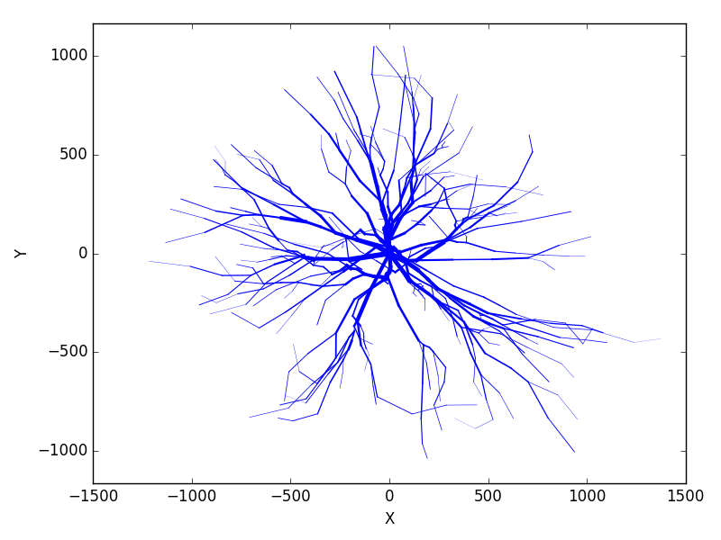

btmorph v2
===========

Introduction
------------

Small Python library containing a data structure and tools to represent and analyze neuronal morphologies stored in the *de facto* standard SWC format [#f1]_ . 

v2 is a refactored version and an object-oriented design. As such, the features can be expanded easily in the future. Moreover, btmorph_v2 has experimental support for the new Neuronal Morphology Format (NMF).

Installation
------------

Prerequisites 
~~~~~~~~~~~~~~

You will need Python (2.7), `Numpy <http://numpy.org>`_ / `Scipy <http://scipy.org>`_ and `Matplotlib <http://matplotlib.org/>`_ to run the code. `IPython <http://ipython.org>`_ is highly recommended because it provides an interactive environment (like Matlab) for Python.

v2 is a new, object-oriented version of btmorph with a cleaner interface (API).

v2 Also allows 3D plotting and animations using openGL. The following libraries are also required when using the plot3DGL function: `imageio <https://imageio.github.io/>`_ and `openGL <http://pyopengl.sourceforge.net/>`_. 

* Linux: Most linux distributions contain versions of these packages in their package manager that can readily be installed.

* Windows and Mac: There are "scientific python" bundles that are shipped with all the aforementioned packages; most famously from `Anaconda <http://docs.continuum.io/anaconda/install.html>`_ or `Enthough <https://www.enthought.com/products/epd/free/>`_. Alternatively check the Ipython `installation <http://ipython.org/install.html>`_.

Proper installation
~~~~~~~~~~~~~~~~~~~

.. note:: The following instructions are for Linux and Max OSX systems and only use command line tools. Please follow the appropriate manuals for Windows systems or tools with graphical interfaces.

Check out the git repository and adjust your :code:`$PYTHONPATH`. 
::
    git clone https://github.com/btorboist/btmorph_v2
    cd btmorph_v2
    export PYTHONPATH=$(pwd):$PYTHONPATH

The above commands will temporarily set your :code:`$PYTHONPATH`. Add the appropriate path in your :code:`.bashrc` to make add the package permanently.

Test the installation by running the tests (see :ref:`unit_testing`):
::
    nosetests -v --nocapture tests/structs_test.py

Data representation
--------------------

Neurons not only look like the branching of trees, their structure is, mathematically speaking a tree structure because they can be represented as graphs without cycles. More precisely, when disregarding the soma, a neuron is a binary tree. That is a tree with at most two children at any node. As such, a **tree data structure** provides an intuitive representation of a morphology and can be easily probed to calculate morphometric features. 

The tree is implemented as a linked list data structure (Tree). Each item in the list/tree is a node (Node) and contains pointers to its parent (:code:`get_parent`) and its children (:code:`get_children`). Each node can store *something* in its designated :code:`content` container. By design, the content is a Python dict and in this library it has at least one key: :code:`'p3d'`, a P3D object. This tree data structure conceptually resembles the structure of an SWC file.

Schematically, it looks like this:

.. image:: docs/figures/data_structure.png
  :scale: 25

.. _design_requirements:

Design requirements
-------------------

A small set of library containing an efficient data structure and routines to quickly analyze morphometric features of neuronal morphologies. In v2, the design is object oriented rather than working with static procedures on data objects. 

The internal representation is based on a tree data-structure (rather than an adjacency matrix as in the `TREES toolbox <http://www.treestoolbox.org/>`_). 

Atomic functions are provided to allow usage in scripting and enable the user to built more complex morphometrics on top of the provided functionality. The code is serial (i.e., non-parallel) because single neuron morphometrics are fast to compute. When analyzing a batch of morphologies a parallel wrapper can be written (e.g., using Pythons's multiprocessing module or more fancy using MPI).

The input is a digital representation of a neuronal morphology in the SWC format. This is the current *de facto* format also used on the curated NeuroMorpho.org  `website <http://neuromorpho.org>`_.org database. It is expected to use the standardized SWC-format that follows the three-point soma description (see `here <http://neuromorpho.org/neuroMorpho/SomaFormat.html>`_). Analysis is based on the whole neuron but subtrees can be selectively analyzed based on the value of the SWC-type field.

Morphometrics can be either scalar (= one value per morphology) or vector / distributed (= a distribution of values per morphology). For vector morphometrics, the features can be measures either a branching point, terminal points or both. Other 'points' specified in the SWC file are only used for the internal representation of the geometry.

Simple wrappers are provided to analyze single neurons, populations thereof and compare two populations. [TODO in v2]

.. Routines are atomic functions that can be used by end-users in scripts and used to build more complex morphometrics. Additionally, basic visualization of neuronal topology ("dendrogram") and geometry can be performed.
.. For now, the analysis is based on the whole neuron. In case you want to analyze only a part of the morphology, you have to filter the SWC file first and run the analysis on the resulting filtered file.
   

Morphometric features
~~~~~~~~~~~~~~~~~~~~~

* Scalar: (one per morphological structure under scrutiny)

  * total size: total length of the neurite
  * # stems
  * # branch points
  * # terminal points
  * width (without translation; absolute coordinates; potential extension along the first 3 principal components)
  * height 
  * depth
  * max degree (of neurites sprouting at the soma)
  * max order (of neurites sprouting at the soma)
  * partition asymmetry (can/cannot be measured at the soma?)

* Vector: (for each point, bifurcation point or terminal point):

  * segment path length (incoming)
  * segment euclidean length (incoming)
  * contraction (euclidean / path; incoming)
  * order
  * degree
  * partition asymmetry
  * fractal dimension (of path between soma and PoI)
  * `Clouds`: save x,y,z coordinates for post-hoc histograms analysis or other scalar (e.g., moments) or vector properties (e.g., PCA)

Visualization
~~~~~~~~~~~~~

Plain vanilla using matplotlib:

* Dendrogram
* 2D/3D plot as wires and/or with diameters
* Three 2D projections for improved visual inspection

More advanced using openGL:

* 3D plot

Quick example
-------------

In the top directory of the package (:code:`btmorph_v2`) open :code:`ipython --pylab` and issue the command below.

.. note:: In :code:`ipython` you can use the magic function :code:`%paste` to paste a whole code block. Copy the code below and type :code:`%paste` at the :code:`ipython` prompt.

::

   import btmorph2
   import numpy
   import matplotlib.pyplot as plt

   neuron1= btmorph2.NeuronMorphology("examples/data/v_e_moto1.CNG.swc")

   # get the total length
   total_length = neuron1.total_length()
   print "total_length = %f" % total_length

   # get the max degree, i.e., degree of the soma
   max_degree1 = neuron1.max_degree()
   max_degree2 = neuron1.degree_of_node(neuron1.tree.root)
   print "max1=%i, max2=%i" % (max_degree1,max_degree2)

   # plot 2D projection
   neuron1.plot_2D()
   plt.savefig('examplar_2D.png')

The last command will have saved the following figure in PNG format.

References

.. [#f1] Cannon et al. *An online archive of reconstructed hippocampal neurons.*, J. Neurosci. methods (pubmed `<http://www.ncbi.nlm.nih.gov/pubmed/9821633>`_).

Citation
---------

If you use this software, please cite the following peer-reviewed news item published in the Neuroinformatics journal.

*B. Torben-Nielsen, An efficient and extendable Python library to analyze neuronal morphologies. Neuroinformatics, 12:619-622 (2014) (` <http://link.springer.com/article/10.1007/s12021-014-9232-7>`_).*
